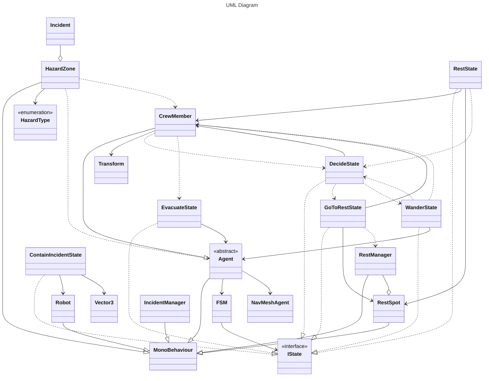

# IA Project1

## Group Members  

### Bernardo Barros a22401588

- Design of simulation base layout;
- Writting project report;

### Ivan Emídio a22301234

- Pathfinding implementation;
- Fixed State Machine implementation;

### Simão Durão a22408594

- Accident creation logic;
- Accident management State logic for simulation agents;
- Evacuation State logic for simulation agents;

## Introduction

In the context of our Artificial Intelligence course subject, we were proposed a project to develop a simulation in Unity that replicates the behaviour of agents on a Mars habitat colony, in which the agents of the simulation would be required to perform work tasks on specific areas of the base as well as satisfy their need for rest. Agents would also be required to react to incidents in the base and act accordingly either by attempting to contain and resolve the incident or escaping through the emergency exits.

Research performed for project resolution:

-Layout of base: Zhong, Y., Wu, T., Han, Y., Wang, F., Zhao, D., Fang, Z., Pan, L., & Tang, C. (2025). Advancements in Mars Habitation Technologies and Terrestrial Simulation Projects: A Comprehensive Review. Aerospace, 12(6), 510. <https://doi.org/10.3390/aerospace12060510>

## Methodology

## Results and Discussion

## Conclusions